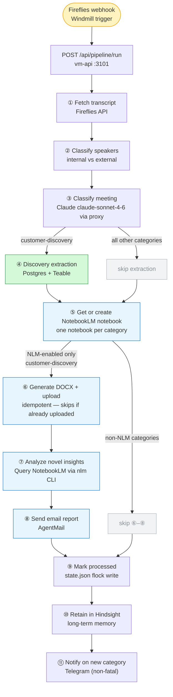

# Automations Pipeline

Processes Fireflies meeting transcripts end-to-end: fetch → classify → extract → analyze → email. Runs on the Paperclip VM at port 3101, called by Windmill after Fireflies fires the `f/discovery/fireflies_webhook` flow.

## Flow

> Open and edit: [pipeline-flow.excalidraw](docs/pipeline-flow.excalidraw)



## Filters

### Which meetings run the discovery extraction (Step ④)?

Only `customer-discovery` meetings. Everything else (investor calls, classes, team syncs) skips Step ④.

### Which meetings run the NotebookLM upload (Steps ⑤–⑥)?

Controlled by `NLM_UPLOAD_CATEGORIES` in [`config.py`](config.py) — defaults to every entry in `KNOWN_CATEGORIES`:

```python
NLM_UPLOAD_CATEGORIES = set(KNOWN_CATEGORIES.keys())
```

Any named category (classes, investor calls, team syncs, advisors, etc.) gets a per-category NotebookLM notebook with the meeting transcript uploaded as a source. Ad-hoc/unknown categories skip upload entirely so we don't create orphan notebooks.

### Which meetings run the analysis + email loop (Steps ⑦–⑧)?

Controlled by `NLM_ANALYSIS_CATEGORIES` in [`config.py`](config.py):

```python
NLM_ANALYSIS_CATEGORIES = {"customer-discovery"}
```

Only `customer-discovery` triggers the novel-insights analysis and email. Other categories have no `[INTERVIEWEE]` speaker, so the analysis prompt returns noise.

### Meeting categories

| Slug | Description | Extraction | NLM Upload | Analysis + Email |
|------|-------------|-----------|------------|------------------|
| `customer-discovery` | Customer interviews, sales calls, prospect demos, distributor/retailer conversations | ✅ | ✅ | ✅ |
| `investor-calls` | VCs, angels, fundraising | — | ✅ | — |
| `team-syncs` | Internal standups, retrospectives | — | ✅ | — |
| `competitors` | Competitive research calls | — | ✅ | — |
| `advisors` | Advisor and mentor meetings (business mentorship, strategy, growth guidance) | — | ✅ | — |
| `tools-research` | Technical tool evaluation, workflow automation research, software product evaluations | — | — ¹ | — |
| `class-mge` | Managing Growing Enterprises | — | ✅ | — |
| `class-sales` | Building Sales Organizations | — | ✅ | — |
| `class-leadership` | The Art of Leading in Challenging Times | — | ✅ | — |
| `class-taxes` | Taxes and Business Strategy | — | ✅ | — |
| `class-fsa` | Financial Statement Analysis | — | ✅ | — |
| `class-fin-trading` | Financial Trading Strategies | — | ✅ | — |
| `class-conv-mgmt` | Conversations in Management | — | ✅ | — |
| `class-policy` | Policy Proposals & Political Strategy | — | ✅ | — |
| `class-humor` | Comedy Fundamentals | — | ✅ | — |
| *(new slug)* | Auto-generated for unknown types | — | — | — |

Unknown meeting types get a descriptive slug (e.g. `conference-panel`). Add them to `KNOWN_CATEGORIES` in `config.py` to give them a human-readable notebook title and enable NLM upload.

¹ `tools-research` is a known classifier output but is not yet in `KNOWN_CATEGORIES` — add it to `config.py` to enable NLM archiving. See [CLAUDE.md](CLAUDE.md) for the two-step process.

### `Internal:` title override (Steps ⑦–⑧)

Meetings with titles starting `Internal:` (case-insensitive) skip the novel-insights analysis + email **even when the classifier returns `customer-discovery`**. Upload to the per-category notebook still runs so the transcript stays archived; only the email is suppressed.

Rationale: founders use `Internal:` as a personal naming convention for team-internal recordings. The classifier sometimes overrides based on content — e.g. an `Internal:`-titled call that's actually a real prospect chat — and would fire a misleading novel-insights email. The title prefix is authoritative for the email decision; the classifier remains authoritative for upload/extraction destinations.

### Backfilling missed meetings

When meetings exist in Fireflies but didn't land in the right NotebookLM notebook (gate-logic regression, pre-webhook history, classifier mis-bucket), use the operational runbook: [`docs/backfill-runbook.md`](docs/backfill-runbook.md). `POST /api/pipeline/run` accepts `force: true` to replay a meeting that's already in `_processed`.

### Internal team filter (Step ②)

Speakers are matched against `INTERNAL_TEAM_NAMES` in `config.py` (case-insensitive substring):

```python
INTERNAL_TEAM_NAMES = ["elman", "klara", "broccoli"]
```

Internal speakers get the `[BROCCOLI TEAM]` label. External speakers get `[INTERVIEWEE]`. The AI prompts extract insights **only from `[INTERVIEWEE]` lines**.

## Prompts

| Prompt | File | Purpose |
|--------|------|---------|
| Meeting classifier | [`classifier.py` — `SYSTEM_PROMPT`](classifier.py#L9) | Assigns a category slug to each meeting based on title, participants, and transcript. Distinguishes between `advisors` (business mentorship and strategy) and `tools-research` (technical tool evaluation and product analysis) based on conversation context. |
| Novel insights | [`analyzer.py` — `PROMPT_NOVEL`](analyzer.py#L46) | Queries NotebookLM for insights from the newest interview that never appeared before |
| Aggregate patterns | [`analyzer.py` — `PROMPT_PATTERNS`](analyzer.py#L19) | Used by the weekly report — cross-meeting pattern analysis |

## Idempotency

Windmill can retry jobs. The pipeline is safe to re-run:

- **Processed check** — `state.json` stores all processed meeting IDs. Duplicate webhook calls are skipped.
- **In-flight guard** — `_in_flight` set blocks a second concurrent run for the same meeting ID within the same process.
- **NLM upload guard** — `state.json` tracks `_nlm_uploaded` per meeting. If `add_file_source` succeeded but `analyze_novel` failed, a retry will skip the upload and run only the analysis.
- **File lock** — all `state.json` writes use `fcntl.flock` exclusive locks to prevent concurrent Windmill jobs from corrupting the file. Per-category locks avoid a slow notebook-create subprocess blocking unrelated writes.

## Key Files

| File | Purpose |
|------|---------|
| `main.py` | FastAPI app, `/api/pipeline/run` and other endpoints |
| `pipeline_runner.py` | Full pipeline orchestration — all 11 steps |
| `config.py` | Categories, internal team names, NLM filter, API keys |
| `speaker_roles.py` | Classifies speakers as internal or external |
| `transcript_formatter.py` | Produces `[BROCCOLI TEAM]`/`[INTERVIEWEE]` labeled transcripts |
| `classifier.py` | Sends transcript to Claude proxy, returns meeting category |
| `discovery_extractor.py` | Extracts structured insights from customer-discovery calls |
| `docx_generator.py` | Generates role-labeled DOCX transcript for NotebookLM upload |
| `notebooklm.py` | Creates notebooks and uploads DOCX sources via `nlm` CLI |
| `analyzer.py` | Queries NotebookLM for novel insights and aggregate patterns |
| `emailer.py` | Sends insight report emails via AgentMail |
| `hindsight.py` | Retains meeting context in Hindsight long-term memory |
| `state.py` | Reads/writes `state.json` — processed IDs, notebook IDs, upload flags |

## Deploy

```bash
# Normal: push to main → GitHub Actions deploys automatically
git push origin main
```

Do not SCP or edit code on the VM directly. The deploy workflow (`deploy.yml`) handles rsync, env migration, migrations, and restart with a health check gate. See [docs/reference-ci-cd.md](../docs/reference-ci-cd.md) for the full deploy sequence.

```bash
# Manual vm-api restart only — to pick up env changes without a full deploy:
gcloud compute ssh paperclip-vm --tunnel-through-iap --zone=us-central1-f \
  --project=paperclip-tribuai -- 'sudo systemctl restart vm-api'
```

## Tests

```bash
uv run pytest tests/ -v   # 45 tests
```
