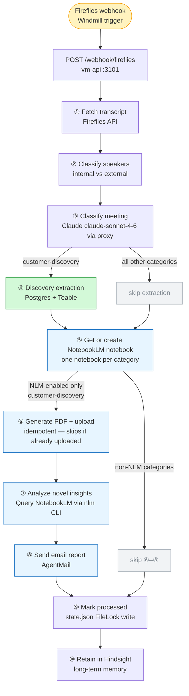

# Automations Pipeline

Processes Fireflies meeting transcripts end-to-end: fetch → classify → extract → analyze → email. Runs on the Paperclip VM at port 3101, triggered by Windmill via webhook.

## Flow

> Open and edit: [pipeline-flow.excalidraw](docs/pipeline-flow.excalidraw)



## Filters

### Which meetings run the discovery extraction (Step ④)?

Only `customer-discovery` meetings. Everything else (investor calls, classes, team syncs) skips Step ④.

### Which meetings run the NotebookLM + email loop (Steps ⑤–⑧)?

Controlled by `NLM_ENABLED_CATEGORIES` in [`config.py`](config.py):

```python
NLM_ENABLED_CATEGORIES = {"customer-discovery"}
```

Classes, team syncs, and internal meetings skip Steps ⑤–⑧ entirely — no interviewees means the NLM prompt returns nothing useful and emails are noise.

### Meeting categories

| Slug | Description | Extraction | NLM + Email |
|------|-------------|-----------|-------------|
| `customer-discovery` | Customer interviews, sales calls, prospect demos, distributor/retailer conversations | ✅ | ✅ |
| `investor-calls` | VCs, angels, fundraising | — | — |
| `team-syncs` | Internal standups, retrospectives | — | — |
| `competitors` | Competitive research calls | — | — |
| `advisors` | Advisor and mentor meetings (business mentorship, strategy, growth guidance) | — | — |
| `tools-research` | Technical tool evaluation, workflow automation research, software product evaluations | — | — |
| `class-mge` | Managing Growing Enterprises | — | — |
| `class-sales` | Building Sales Organizations | — | — |
| `class-leadership` | The Art of Leading in Challenging Times | — | — |
| `class-taxes` | Taxes and Business Strategy | — | — |
| `class-fsa` | Financial Statement Analysis | — | — |
| *(new slug)* | Auto-generated for unknown types | — | — |

Unknown meeting types get a descriptive slug (e.g. `conference-panel`). Add them to `KNOWN_CATEGORIES` in `config.py` to give them a human-readable notebook title.

### Internal team filter (Step ②)

Speakers are matched against `INTERNAL_TEAM_NAMES` in `config.py` (case-insensitive substring):

```python
INTERNAL_TEAM_NAMES = ["elman", "klara", "broccoli"]
```

Internal speakers get the `[BROCCOLI TEAM]` label. External speakers get `[INTERVIEWEE]`. The AI prompts extract insights **only from `[INTERVIEWEE]` lines**.

## Prompts

| Prompt | File | Purpose |
|--------|------|---------|
| Meeting classifier | [`classifier.py` — `SYSTEM_PROMPT`](classifier.py#L9) | Assigns a category slug to each meeting based on title, participants, and transcript. Distinguishes between `advisors` (business mentorship and strategy) and `tools-research` (technical tool evaluation and product analysis) based on conversation context. |
| Novel insights | [`analyzer.py` — `PROMPT_NOVEL`](analyzer.py#L46) | Queries NotebookLM for insights from the newest interview that never appeared before |
| Aggregate patterns | [`analyzer.py` — `PROMPT_PATTERNS`](analyzer.py#L19) | Used by the weekly report — cross-meeting pattern analysis |

## Idempotency

Windmill can retry jobs. The pipeline is safe to re-run:

- **Processed check** — `state.json` stores all processed meeting IDs. Duplicate webhook calls are skipped.
- **In-flight guard** — `_in_flight` set blocks a second concurrent run for the same meeting ID within the same process.
- **NLM upload guard** — `state.json` tracks `_nlm_uploaded` per meeting. If `add_pdf_source` succeeded but `analyze_novel` failed, a retry will skip the upload and run only the analysis.
- **FileLock** — all `state.json` writes use `filelock.FileLock` to prevent concurrent Windmill jobs from corrupting the file.

## Key Files

| File | Purpose |
|------|---------|
| `main.py` | FastAPI app, `/webhook/fireflies` and `/api/pipeline/run` endpoints |
| `pipeline_runner.py` | Full pipeline orchestration — all 10 steps |
| `config.py` | Categories, internal team names, NLM filter, API keys |
| `speaker_roles.py` | Classifies speakers as internal or external |
| `transcript_formatter.py` | Produces `[BROCCOLI TEAM]`/`[INTERVIEWEE]` labeled transcripts |
| `classifier.py` | Sends transcript to Claude proxy, returns meeting category |
| `discovery_extractor.py` | Extracts structured insights from customer-discovery calls |
| `pdf_generator.py` | Generates role-labeled PDF for NotebookLM upload |
| `notebooklm.py` | Creates notebooks and uploads PDF sources via `nlm` CLI |
| `analyzer.py` | Queries NotebookLM for novel insights and aggregate patterns |
| `emailer.py` | Sends insight report emails via AgentMail |
| `hindsight.py` | Retains meeting context in Hindsight long-term memory |
| `state.py` | Reads/writes `state.json` — processed IDs, notebook IDs, upload flags |

## Deploy

```bash
gcloud compute scp -r /Users/elmanamador/coding/automations/vm-api paperclip-vm:~/ --zone=us-central1-f
gcloud compute ssh paperclip-vm --zone=us-central1-f -- 'sudo systemctl restart vm-api'
```

## Tests

```bash
uv run pytest tests/ -v   # 42 tests
```
